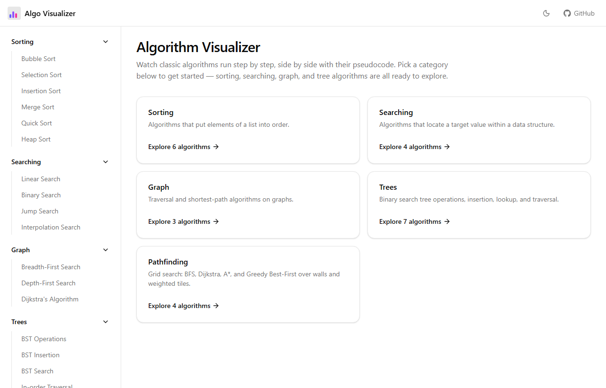
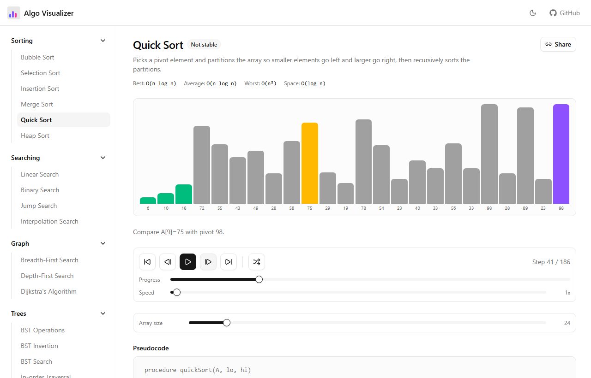
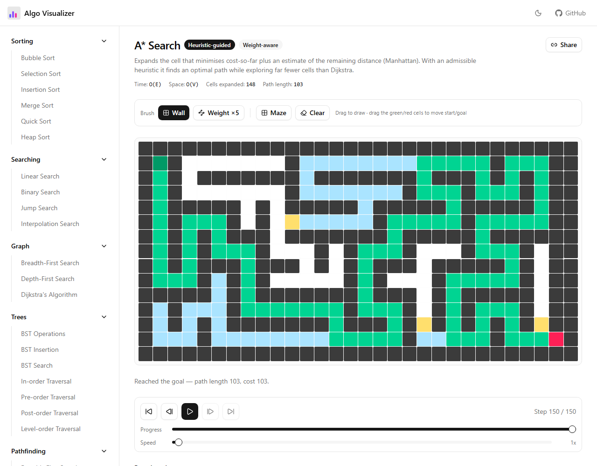
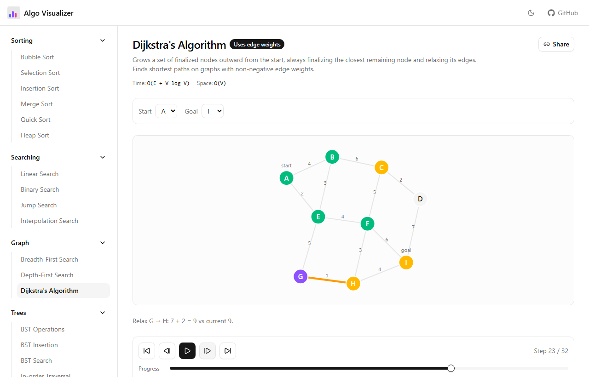
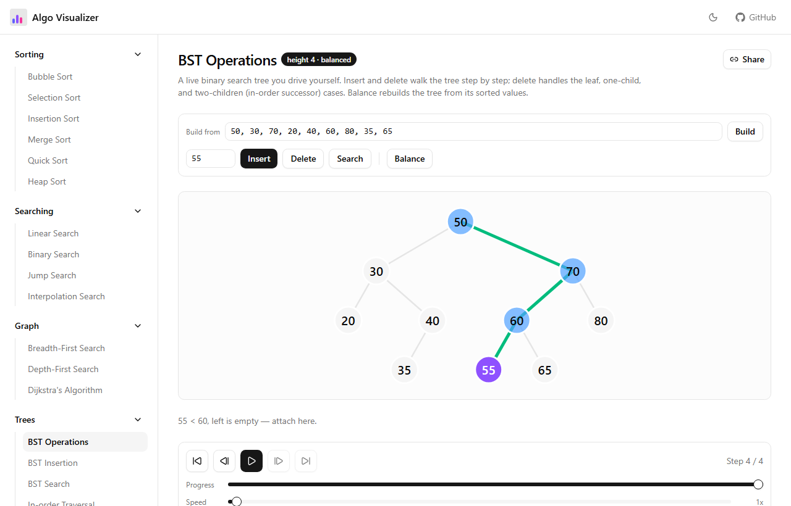

# Algorithm Visualizer

[](https://github.com/suhrusai/algorithm-visualizer/actions/workflows/ci.yml)
[](https://suhrusai.github.io/algorithm-visualizer/)
[](LICENSE)

Watch classic algorithms run one step at a time, side by side with their
pseudocode — sorting, searching, graphs, binary search trees, grid
pathfinding, dynamic programming, and string matching, all in one small,
fast, keyboard-friendly site.

<p align="center">
  <a href="https://suhrusai.github.io/algorithm-visualizer/">
    
  </a>
</p>

<p align="center">
  <strong><a href="https://suhrusai.github.io/algorithm-visualizer/">▶ Live demo</a></strong>
</p>

---

## Features

- **Step-synced pseudocode** — every visualization highlights the exact
  pseudocode line responsible for the current frame.
- **Full playback controls** — play/pause, step forward/back, scrub, reset,
  and a speed dial from 0.25× to 100×.
- **Physical sorting bars** — elements slide between positions as they move
  instead of values snapping in place.
- **Interactive inputs** — draw walls and weighted tiles, generate mazes,
  drag graph endpoints, build a BST from your own numbers.
- **Shareable links** — the array seed, size, target, grid layout, and speed
  live in the URL; the **Share** button copies a link that reproduces exactly
  what you're looking at.
- **Algorithm race** — run 2–4 sorts on the same array against one timeline
  with comparison / write / step counters.
- **Light & dark**, responsive, no backend.

## Visualizations

| Category | Algorithms |
| --- | --- |
| **Sorting** | Bubble · Selection · Insertion · Merge · Quick · Heap |
| **Searching** | Linear · Binary · Jump · Interpolation |
| **Graph** | BFS · DFS · Dijkstra · A\* · Bellman–Ford · Prim's MST · Kruskal's MST |
| **Trees** | BST insert / search / delete / rebalance · in-, pre-, post-, level-order traversal |
| **Pathfinding** | BFS · Dijkstra · A\* · Greedy Best-First (grid, walls, weights, mazes) |
| **Dynamic programming** | LCS · Edit distance · 0/1 knapsack · Coin change · LIS |
| **String matching** | Naive · Knuth–Morris–Pratt · Boyer–Moore · Rabin–Karp |
| **Race modes** | 2–4 sorting algorithms, or the four pathfinders on one maze |

<table>
  <tr>
    <td></td>
    <td></td>
  </tr>
  <tr>
    <td></td>
    <td></td>
  </tr>
</table>

## Tech stack

- **React 19** + **TypeScript**, routed with **React Router 7**
- **Vite 8** build, **Tailwind CSS 4**, **shadcn/ui** + **Radix** primitives
- **oxlint** for linting, **Vitest** for the algorithm test suite
- Deployed to **GitHub Pages** via GitHub Actions

## Architecture

Every algorithm is a pure function that takes its input and returns an array of
immutable **step** objects — a state snapshot, which elements are being touched,
the active pseudocode line, and a human-readable message. A generic
`useStepPlayer` hook walks that array; category-specific components
(`SortBars`, `GraphCanvas`, `TreeCanvas`, `GridCanvas`, …) render one step.

```
src/
├── algorithms/         # pure step-generating functions, grouped by category
│   ├── sorting/  searching/  graph/  tree/  pathfinding/
├── components/          # visualizers, canvases, playback controls
├── hooks/               # useStepPlayer, useUrlState, useTheme
├── lib/                 # seeded RNG, SEO route table, helpers
├── pages/               # one index + one detail page per category
└── data/categories.ts   # drives the sidebar and home grid
```

## Getting started

```bash
git clone https://github.com/suhrusai/algorithm-visualizer.git
cd algorithm-visualizer
npm install
npm run dev        # http://localhost:5173
```

```bash
npm run build      # type-check + production build to dist/
npm run preview    # serve the production build
npm run lint
```

Requires Node 20+.

## Adding a new algorithm

1. Create a file under `src/algorithms/<category>/` that exports an object
   matching that category's algorithm type (see `src/types/`), implementing
   `run(...)` to return the list of step objects.
2. Register it in `src/algorithms/<category>/index.ts`.

The visualizer, controls, pseudocode panel, sidebar entry, route, sitemap
entry, and page `<title>` are all generic and wire up on their own.

## Roadmap

- [ ] Turbo mode: un-recorded live sorting for very large arrays
- [ ] Topological sort and strongly-connected components on a directed sample
- [ ] Self-balancing trees (AVL, red–black) with rotation animations
- [ ] Plain-English explanations per step
- [ ] Recorded GIF export of a run

## Contributing

Issues and pull requests are welcome. For a change of any size:

1. Fork and branch from `main`.
2. `npm run lint`, `npm run test`, and `npm run build` must pass (CI runs all three).
3. Keep algorithm functions pure and deterministic (seeded RNG only).
4. For a new visualization, include a screenshot in the PR.

## License

[MIT](LICENSE)
